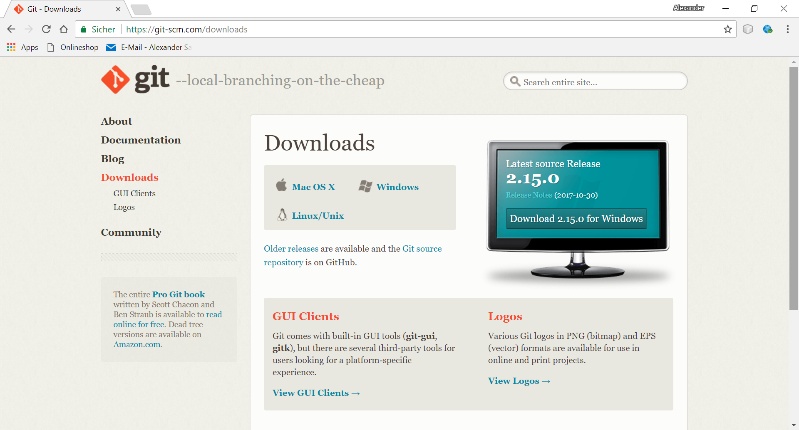
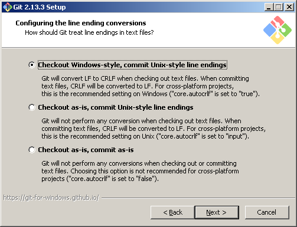
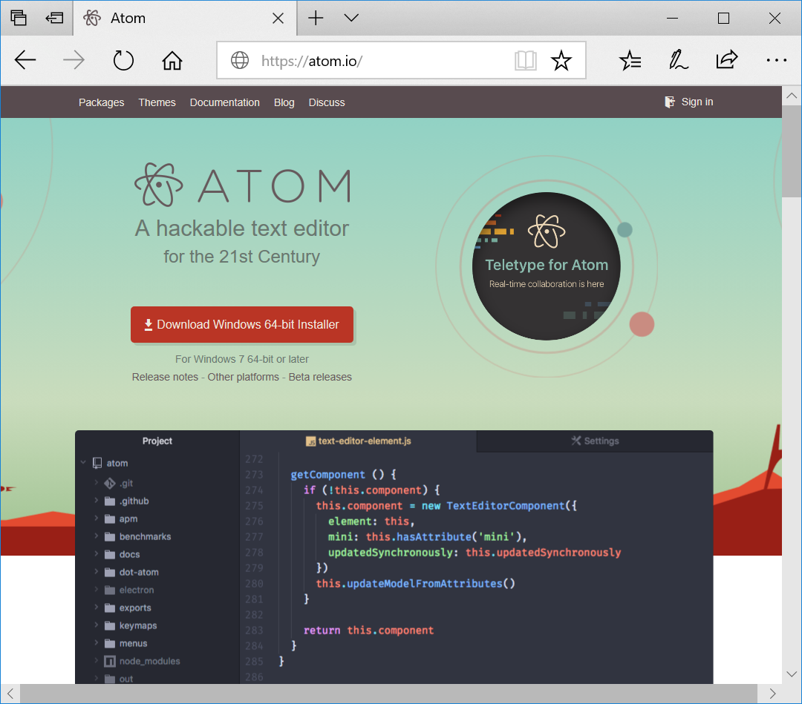

[[werkzeuge-einrichten]]
= Werkzeuge einrichten

Die IsyFact-Dokumentation wird in der vereinfachten Auszeichnungssprache AsciiDoc verfasst.

NOTE: AsciiDoc ist leicht erlernbar und ermöglicht, dass die textuelle Rohfassung in verschiedenen Ausgabeformaten wie beispielsweise HTML oder PDF ausgegeben werden kann.

Die in AsciiDoc verfassten Dokumente werden auf dem internen GitLab-Repository der BVA gesichert.
Die Sicherung der textuellen Rohfassung auf dem Git-basierten Repository gewährleistet die zeitgleiche Zusammenarbeit mehrerer Autoren am gleichen Dokument und die Wiederherstellung eines älteren Stands.

[[mit-git-arbeiten]]
== Mit Git arbeiten

Um ein neues IsyFact-Dokument zu erstellen, benötigen Sie die Dokument-Vorlage.
Die Dokument-Vorlage befindet sich im Projekt `isy-documentation` auf dem GitLab-Repository der BVA.

[[git-installieren]]
=== Git installieren

Um die Dokument-Vorlage vom GitLab-Repository zu beziehen, brauchen Sie das Versionierungswerkzeug Git, das Sie von der Webseite http://www.git-scm.com herunterladen können.

:desc-image-git1: Das Webportal des Versionierungssystems Git
[id="image-git1",reftext="{figure-caption} {counter:figures}"]
.{desc-image-git1}

Weil das GitLab-Repository von der BVA auf einem Unix-basierten Betriebssystem installiert ist, Sie aber als technischer Autor der BVA eventuell auf einem Windows-Betriebssystem arbeiten, besteht eine Diskrepanz bei den Zeilenumbrüchen.
Denn während Windows die Zeichen Carriage-Return (`'\r'`) und New-Line (`'\n'`) einsetzt, um das Zeilenende anzuzeigen, verwendet Unix lediglich ein New-Line (`'\n'`).
Um dieses Problem zu lösen, wird bei der Installation von Git folgendes Fenster mit drei Optionen angeboten.

:desc-image-git2: Das Webportal des Versionierungssystems Git
[id="image-git2",reftext="{figure-caption} {counter:figures}"]
.{desc-image-git2}

Bei der ersten Option geht Git genau von der Konstellation aus, die auch bei der IsyFact-Dokumentation gebraucht wird.
Denn mit dieser Option ändert Git die heruntergeladenen Zeilenumbrüche zur Windows-Variante um.
Beim Hochladen wird hingegen zur Unix-Variante zurückgewandelt.
Sollten Sie lokal mit Windows arbeiten, selektieren Sie also die erste Option.

[[atom-installieren]]
== Atom installieren

Bei IsyFact werden die AsciiDoc-Dokumente mit Atom geschrieben.
Atom ist ein Open-Source-Texteditor, der von der Github Incorporation entwickelt wurde.
Die Installationsdatei von Atom kann beim Webportal https://atom.io heruntergeladen werden.

:desc-image-atom: Das Webportal des Texteditors Atom
[id="image-atom",reftext="{figure-caption} {counter:figures}"]
.{desc-image-atom}

[[wie-neue-dokumente-erstellt-werden]]
= Wie neue Dokumente erstellt werden

[[das-gesamtprojekt-isy-documentation-herunterladen]]
=== Das Gesamtrojekt `isy-documentation` herunterladen

IsyFact legt eine bestimmte Verzeichnisstruktur für die Dokumentation fest.
Als technischer Autor werden Sie Ihr IsyFact-Dokument in einem bestimmten Ordner dieser Verzeichnisstruktur ablegen.
Dies setzt voraus, dass Sie das Gesamtprojekt zunächst vom GitLab-Repository herunterladen.
Hierfür wechseln Sie auf der Kommandozeile auf eine geeignete Stelle Ihrer lokalen Festplatte und geben dort das Git-Kommando `git clone <GitLab-URL>` ein, das das entfernte Git-Projekt `isy-documentation` herunterlädt.

NOTE: Die korrekte GitLab-URL für das Repository erhalten Sie von Ihrem Projektleiter.

[source, shell]
====
C:\> cd <Verzeichnis Ihrer Wahl> +
C:\> git clone <GitLab-URL> +
====

NOTE: git clone lädt standardmäßig den Master-Branch herunter. Sollte Ihnen die Berechtigung für das Editieren des Master-Branches fehlen, müssen Sie das Project zunächst forken und nach Fertigstellung Ihrer Arbeiten jeweils einen Merge über einen Pull-Request anfordern.
Beachten Sie hierzu das <<konzept-github>>.

[[die-verzeichnisstruktur-der-isyfact-dokumentation-kennenlernen]]
=== Die Verzeichnisstruktur der IsyFact-Dokumentation kennenlernen

Beim Herunterladen des GitLab-Projekts wird an der betroffenen Stelle ein Verzeichnis mit dem Namen `/isy-documentation` angelegt und darunter das Verzeichnis `/src`.
Unterhalb von `/src` befinden sich die Verzeichnisse `/docs`, `/scripts` und `/theme`.
Während `/scripts` und `/theme` die Skripte zur automatisierten Verarbeitung enthalten, befinden sich unterhalb von `/docs` die Verzeichnisse der IsyFact-Dokumentation.

Auf oberster Ebene sehen Sie die Verzeichnisse `/10_IsyFact_Standards` (für das Fundament von IsyFact) und `/20_IsyFact_Erweiterungen` (für die optionalen wiederverwendbaren Lösungen).

Die Unterordner dieser beiden Verzeichnisse entsprechen den IsyFact-Säulen

die Dokumente gemäß der IsyFact-Artefakte gegliedert.

Diese bildet die Ebenen und Säulen der IsyFact Software-Factory wieder.

[verzeichnisstruktur-der-isyfact-dokumentation]
.Die Verzeichnisstruktur der IsyFact-Dokumentation
10_IsyFact_Standards:: Das Fundament, mit allgemeingültigen und wiederverwendbaren Konzepten
00_Allgmein;; Einstiegsdokumente, Tutorial, Konventionen
10_Blaupausen;; Grundlagendokumente und Detailkonzepte für Architektur und Anwendungslandschaft
20_Bausteine;; Dokumente für die jeweilig wiederverwendbaren Softwarelösungen
30_Plattform;; Dokumente zum Betrieb und Inbetriebnahme
40_Methodik;; Methodisches bspw. V-Model XT oder Programmierkonventionen
50_Werkzeuge;; bspw. Einrichten der Entwicklungsumgebung
20_IsyFact_Erweiterungen:: Dokumente für optionale Lösungen
(Unterverzeichnisse mit Aufbau wie bei *10_IsyFact_Standards*)

[[ein-neues-verzeichnis-anlegen]]
== Ein neues Verzeichnis anlegen

Dokumente, die im asciidoc-Format geschrieben wurden, erkennt man bei IsyFact unter dem Zusatz `.adoc`.
Die Rohfassung eines IsyFact-Dokuments besteht aber nicht nur aus einem einzigen adoc.-Dokument, sondern gleich aus mehreren.
Um Sie als technischen Autor bei der Erstellung des neuen IsyFact-Dokuments zu unterstützen, wurde ein Verzeichnis mit dem Namen `/src/docs/Dokument-Vorlage` bereitgestellt.
In diesem Verzeichnis befinden sich folgende Dokumente:

- anhaenge.adoc
- docinfo.adoc
- inhalt.adoc
- master.adoc
- preface.adoc
- thisdoc.adoc

Das Verzeichnis `/src/docs/Dokument-Vorlage` ist Ihre Vorlage, die Sie als Quelle zu Ihrem eigenen Zielverzeichnis kopieren.

--------------------------------------------------------------------
[[git-einrichten]]
=== Git einrichten

Jetzt, nachdem Sie Ihr Arbeitsverzeichnis vorbereit haben, können Sie mit der Arbeit loslegen.
Das Edit

[source, shell]
====
git config --global user.name "Michael Mustermann" +
git config --global user.email "MichaelMustermann@bva.bund.de" +
cd <Verzeichnis Ihrer Wahl> +
git clone <GitLab-URL des Projektes isy-documentation> +
====

[source, shell]
====
C:\tmp> _git clone https://git.zssi.ivbb.bund.de/IsyFact/isy-documentation_
====
--------------------------------------------------------------------

[[mit-asciidoc-arbeiten]]
== Mit AsciiDoc arbeiten

[[die-asciidoc-erstellung-in-der-isyfact-dokumentation]]
=== Die Asciidoc-Erstellung in der IsyFact-Dokumentation

Dieses Dokument soll Asciidoc nicht erklären, denn hierzu bieten folgende Webportale bereits sehr ausführliche
Tutorials an:

- `http://asciidoc.org/userguide.html`
- `https://asciidoctor.org/docs/what-is-asciidoc/`
- `http://powerman.name/doc/asciidoc-compact`
- `http://www.vogella.com/tutorials/AsciiDoc/article.html`

Die Lernhürde ist aber denkbar niedrig, denn man schreibt ein AsciiDoc-Dokument wie ein einfaches textuelles Dokument.
Erst wenn zusätzlicher Formatierungsbedarf hinzukommt, ist die Verwendung von Asciidoc-Markups erforderlich.
Die hiervon Gängigste ist die Kapitelüberschrift, die mithilfe von Gleichheitszeichen,
bei IsyFact-Dokumenten mithilfe von Gleichheitszeichen definiert werden.

`*= Kapitel*`

`*== Unterkapitel*`

Für das IsyFact-Dokument ist diese Markierung aber nicht ausreichend, denn bei ihm ist zusätzlich das Setzen eines Referenznamens erforderlich.

`*\[[kapitel]]* +
= Kapitel`

`*\[[unterkapitel]]* +
== Unterkapitel`

[[wie-existierende-dokumente-bearbeitet-werden]]
= Wie existierende Dokumente bearbeitet werden

Um die bearbeiteten Dateien zu sichern, müssen Sie zunächst dem Git System bekannt gemacht werden.
Sie können sich den aktuellen Status über folgendes Kommando zunächst anschauen.

[source, shell]
====
git status
Auf Branch master
Initialer Commit
Unversionierte Dateien:
  (benutzen Sie "git add <Datei>...", um die Änderungen zum Commit vorzumerken)
        docinfo.adoc
        inhalt.adoc
        master.adoc
        preface.adoc
        thisdoc.adoc
nichts zum Commit vorgemerkt, aber es gibt unversionierte Dateien (benutzen Sie "git add" zum Versionieren)
====

Git teilt Ihnen mit, dass Ihr Arbeitsverzeichnis dem Hauptzweig master zugeordnet ist.
Der initiale Commit wurde von Git getätigt, als Sie das Projekt initialisierten.
Weiter unten führt Git die Dateien auf, die den Zustand MODIFIED haben. Hiermit erfahren Sie, dass die aktuelle Version der Dateien weder in der Staging Area vorgemerkt ist, noch im Repository liegt.
Git teilt Ihnen auch mit, dass Sie die Dateien über git add <Datei> für einen Commit vormerken können.
Über folgendes Kommando holen Sie dies nach.

git add .

Jetzt wurden die Dateien in der Staging Area für einen Commit vorgemerkt.
Der Fachbegriff für diesen Zustand lautet STAGED.
Über git status lassen Sie sich erneut den Status anzeigen.

[source, shell]
====
git status
Initialer Commit
zum Commit vorgemerkte Änderungen:
  (benutzen Sie "git rm --cached <Datei>..." zum Entfernen aus der Staging-Area)
        neue Datei:     docinfo.adoc
        neue Datei:     inhalt.adoc
        neue Datei:     master.adoc
        neue Datei:     preface.adoc
        neue Datei:     thisdoc.adoc
====

Wenn Sie die Dateien jetzt editieren (oder das Kommando git rm --cached inhalt.adoc ausführen), setzen Sie ihren Zustand wieder auf MODIFIED zurück.
Wenn Sie mit Ihren Dateien aber zufrieden sind, führen Sie einen Commit aus.

git commit -m "Erste Version"

Wie Sie sehen, müssen Sie dem Commit eine Nachricht mitgeben,
Anschließend werden die Dateien im Repository gesichert.
Der Fachbegriff für diesen Zustand lautet COMMITED.
Die Commits können Sie sich über folgenden Befehl anzeigen lassen.

git log

commit 04c7dfd48e2fd5432c9d24d283f1cc55888b33c0
Author: Michael Mustermann <MichaelMustermann@bva.bund.de>
Date:   Fri Mar 10 16:00:34 2017 +0100
    Erste Version
In der Meldung sehen Sie einen 40-Zeichen langen SHA-1 Hashcode.
Durch diesen Hashcode merkt Git, wenn die Quellen zum Commit korrumpiert werden.
Somit bleibt nichts unbemerkt.
Außerdem garantiert der Hashcode, dass der Commit über das gesamte Projekt hinweg eindeutig identifiziert werden kann.
Denn er birgt auch den Namen, die E-Mail und den Zeitpunkt des Commits.

[[aenderungen-ueber-git-sichern]]
= Änderungen über Git sichern

...

[[wie-zentrale-verzeichnisse-editiert-werden]]
= Wie zentrale Verzeichnisse editiert werden

...
